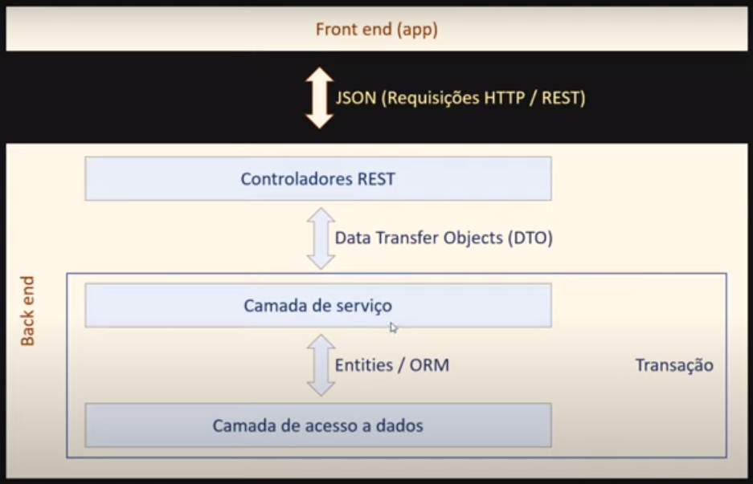

# ds-catalog-devsuperior
DevSuperior Bootcamp 3.0 - Projeto **didático** para o aprendizado de Back-end com Java Spring Boot e Front-end com ReactJS.

## Modelo de Separação de responsabilidades em Camadas


# Modelo de Três Camadas (Controlador / Serviço / Repositório)
**Controlador**: Responder interações do usuário, no caso de uma API REST essas interações são _requisições_. Entrega/Recebe dados DTO da camada de serviço.

**Serviço**: Realiza operações de negócio. Um método da camada de serviço deve ter um _significado_ relacionado ao negócio, podendo executar várias operações. Orquestra operações individuais no repositório para realizar uma operação de negócio. Trabalha com dados ORM e entidades com a camada de repositório.

**Repositório**: Realiza operações "individuais" de acesso ao banco de dados. Trabalha com entidades.

## Capítulo 1 - CRUD de Categorias e Produtos

## Modelo Conceitual


### Competências
- Criar projeto Spring Boot
- Criar monorepo Git
- Organizar o projeto em camadas
  - Controlador REST
  - Serviço
  - Acesso a dados (Repository)
- Criar entidades
- Configurar perfil de teste do projeto
- Seeding da base de dados
- Criar web services REST
  - Parâmetros de rota @PathVariable
  - Parâmetros de requisição @RequestParam
  - Corpo de requisição @RequestBody
  - Resposta da requisição ResponseEntity<T>
- Padrão DTO
- CRUD completo
- Tratamento de exceções
- Postman (coleções, ambientes)
- Dados de auditoria
- Paginação de dados
- Associações entre entidades (N-N) (@ManyToMany)

O CRUD usa um ambiente de testes (manual) configurado acessando o **banco de dados H2**, usa **Maven** como gerenciador de dependência, e **Java 11** como linguagem.
    
##  :dizzy: Como Executar

- ### **Pré-requisitos**

  - É **necessário** possuir o **[Java 11](https://www.java.com/)** e **[Spring Boot](https://spring.io/)** instalados no computador.
  - É **necessário** possuir o **[Git](https://git-scm.com/)** instalado e configurado no computador.
  - É **recomendável** utilizar **[IDE Eclipse com Spring Tools Suite 4](https://spring.io/tools)** .
 

1. Faça um clone do repositório:

```sh
  #  Crie um novo Workspace, uma pasta chamada: workspace-do-tata
  $ md workspace-do-tata
  $ cd workspace-do-tata
  $ git clone https://github.com/tarcnux/ds-catalog-devsuperior
  $ cd ds-catalog-devsuperior
```

2. Executando a Aplicação:

```sh
  #  Abra o Spring Tool Suite (STS)
  #  Selecione o Workspace: workspace-do-tata
  #  Import projects - Maven - Existing Maven Projects
  #  Root Directory: ds-catalog-devsuperior
  #  Clicar com o botão direito em src/main/java
  #  Procurar por "Run As" e ir na opção "Spring Boot App"
  #  Acesse no navegador:
  #     http://localhost:8080/products
  #     http://localhost:8080/categories

```  
[Postman Collection para interação com a API](https://github.com/tarcnux/ds-catalog-devsuperior/blob/main/DSCatalog%20Bootcamp.postman_collection.json)

#### Busca paginada de categorias
    GET /categories?page=0&linesPerPage=12&direction=ASC&orderBy=id

#### Busca de categoria por id
    GET /categories/1

#### Inserção de uma nova categoria

    POST /categories
    {
	    "name": "Garden"
    }

#### Atualização de uma categoria

    PUT /categories/1
    {
	    "name": "Novo nome"
    }

#### Deleção de uma categoria

    DELETE /categories/1 

#### Busca paginada de produtos
    GET /products?page=0&linesPerPage=12&direction=ASC&orderBy=id

#### Busca de produto por id
    GET /products/1

#### Inserção de um novo produto

    POST /products
    {
      "date": "2022-04-15T18:34:59Z",
      "description": "The new generation PS5 video game",
      "name": "PS5",
      "imgUrl": "",
      "price": 600.0,
      "categories": [
        {
          "id": 1
        },
        {
          "id": 3
        }
      ]
    }

#### Atualização de um produto

    PUT /products/1
    {
      "date": "2022-04-15T18:35:59Z",
      "description": "Updated product description",
      "name": "Updated product name",
      "imgUrl": "",
      "price": 600.0,
      "categories": [
        {
          "id": 1
        },
        {
          "id": 3
        }
      ]
    }

#### Deleção de um produto

    DELETE /products/1 
  
## :memo: ToDo

### Spring Boot 
 - [x] Capítulo 01 - CRUD
 - [ ] Capítulo 02 - Testes Automatizados
 - [ ] Capítulo 03 - Validação e Segurança
 - [ ] Capítulo 04 - Domínio e ORM, autorizações
 - [ ] Capítulo 05 - Consultas ao banco de dados
 - [ ] Capítulo 06 - Docker, implantação, CI/CD

### ReactJS
 - [ ] Capítulo 07 - Layout e navegação
 - [ ] Capítulo 08 - Integração com API
 - [ ] Capítulo 09 - Autenticação e autorização
 - [ ] Capítulo 10 - CRUD, paginação, filtros
 - [ ] Capítulo 11 - Testes e implantação
 - [ ] Capítulo 12 - Dashboard

---
[](https://www.linkedin.com/in/tarcnux) 
[](https://www.twitter.com/tarcnux)
